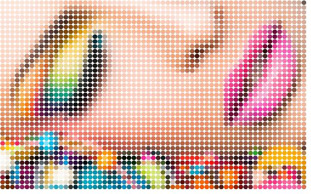
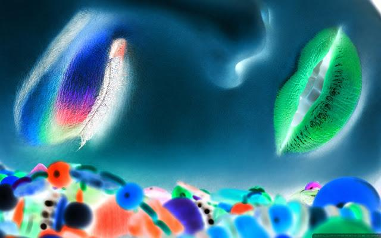

MagicBrush
==========
An Object-Oriented Image Processing Framework in Java
-----------------------------------------------------

Author: Min Xu <xukmin at gmail.com>

**MagicBrush** provides a set of reusable image processing algorithms through
image tranformers, and exposes 3 interfaces, Application Program Interface
(**API**), Command Line Interface (**CLI**), and Graphical User Interface
(**GUI**). The GUI supports real time interaction and animation while
customizing image transformers.

Screenshots
-----------

**Wobble**

**Colored Dots**

**Color Invert**

**Color Cast**

**Grayscale**

**Recolor**

**Blur**

**Mirror**

**Upside Down**

**Color Enhance**

